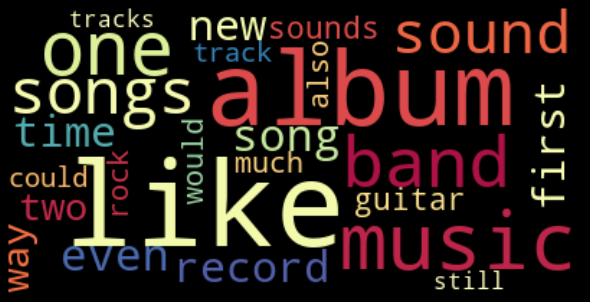
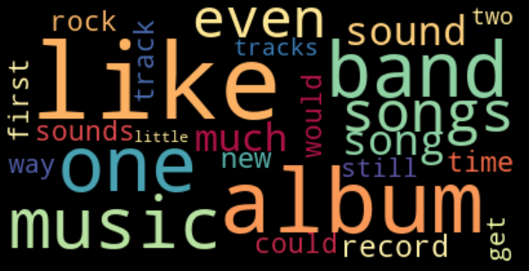

# Classification of Pitchfork Music Reviews
### An Exploration of NLP Methods (Ongoing) By Khyatee Desai

# Introduction
This project explores text preprocessing, stopword removal, lexicon normalization, frequency distribution, part-of-speech analysis, sentiment analysis, vectorization, feature engineering and classification modeling of music reviews published on Pitchfork

# Data
The dataset for this project comes from a Kaggle collection of [song reviews](https://www.kaggle.com/nolanbconaway/pitchfork-data) published on Pitchfork.com. The data is stored as a collection of tables within a Sqlite database.

# Cleaning & Processing 
- join relevant tables
- create the target variable: "good" reviews (scored above 8.0,) and "bad" reviews (scored below 6.0)
- remove stopwords and punctuation
- identify language using langdetect
- stemm and lemmatize

# Exploration
### Frequency Distribution
After creating a frequency distribution, we inspect the most common words used in each class ("good" vs "bad" reviews.) 
**Best Reviews:** 
`('like', 11948),
 ('album', 8745),
 ('music', 8523),
 ('one', 7614),
 ('band', 6755)` 
**Worst Reviews:** 
`('like', 10444),
 ('album', 7030),
 ('one', 5329),
 ('band', 5123),
 ('music', 4562)` 
There does not appear to be a significant difference among the most frequently used words in each review.
### Word Clouds
Word clouds are then generated to visually inspect the most common words in each class: 
**Best Reviews:** 

**Worst Reviews:** 

# Feature Engineering

# Vectorization

# Modeling

# Evaluation

# Next Steps

